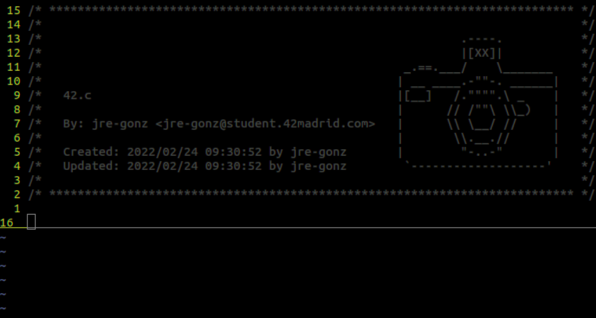

# Custom Header

This project was based on the [42 header](https://github.com/42Paris/42header) repository. Full credit to the original authors for developing the logic.

### **Description**

Logic to have a custom header for vim editor.




### **UNIX Setup**

Copy `customheader.vim` in your `~/.vim/plugin`, or use your favorite plugin
manager. Then set the user and mail variables as explained below.

#### Option 1: export USER and MAIL in your shell configuration file

Add in `~/.zshrc` your:

+ `USER`
+ `MAIL`

#### Option 2: set user and mail values directly in your vimrc

```vim
let g:user42 = 'yourLogin'
let g:mail42 = 'yourLogin@student.42.fr'
```

### **Usage**

In **NORMAL** mode you can use `:Customheader` or simply press the shortcut <kbd>F2</kbd> (or the key you want if you [change your header](#Modify-header)).

<br>

## **Modify header**

### Change activation key:
Open your `~/plugin/customheader.vim` file and change the following line (located at the end):

	map <F2> :Customheader<CR>

Modify the key you want to use (default is <kbd>F2</kbd>).

### **Change header**
Open your `~/plugin/customheader.vim` file and change the following line (located at the end):

	let s:asciiart = [
		\'         .----.        ',
		\'         |[XX]|        ',
		\' _.==.___/    \_______ ',
		\'| __ ____.-""-. ______|',
		\'|[__]   /."""".\ _    |',
		\'|      // /""\ \\_)   |',
		\'|      \\ \__/ //     |',
		\'|       \\.__.//      |',
		\'|        "-..-"       |',
		\" `-------------------' "
		\]

Change it to the one you want. Keep in mind that the use of special characters may not be as easy as you think.

The header should work with a drawing tall enough to display the title, creator and last update.

### **Examples**:
Fell free to use and pull requests your own headers.

- 42:

		let s:asciiart = [
			\"        :::      ::::::::",
			\"      :+:      :+:    :+:",
			\"    +:+ +:+         +:+  ",
			\"  +#+  +:+       +#+     ",
			\"+#+#+#+#+#+   +#+        ",
			\"     #+#    #+#          ",
			\"    ###   ########.fr    "
			\]
<br>

		/* ************************************************************************** */
		/*                                                                            */
		/*                                                        :::      ::::::::   */
		/*   42.c                                               :+:      :+:    :+:   */
		/*                                                    +:+ +:+         +:+     */
		/*   By: jre-gonz <jre-gonz@student.42madrid.com>   +#+  +:+       +#+        */
		/*                                                +#+#+#+#+#+   +#+           */
		/*   Created: 2022/02/24 10:00:40 by jre-gonz          #+#    #+#             */
		/*   Updated: 2022/02/24 10:00:44 by jre-gonz         ###   ########.fr       */
		/*                                                                            */
		/* ************************************************************************** */

- Camera:

		let s:asciiart = [
			\'         .----.        ',
			\'         |[XX]|        ',
			\' _.==.___/    \_______ ',
			\'| __ ____.-""-. ______|',
			\'|[__]   /."""".\ _    |',
			\'|      // /""\ \\_)   |',
			\'|      \\ \__/ //     |',
			\'|       \\.__.//      |',
			\'|        "-..-"       |',
			\" `-------------------' "
			\]
<br>

		/* ************************************************************************** */
		/*                                                                            */
		/*                                                           .----.           */
		/*                                                           |[XX]|           */
		/*                                                   _.==.___/    \_______    */
		/*                                                  | __ ____.-""-. ______|   */
		/*   42.c                                           |[__]   /."""".\ _    |   */
		/*                                                  |      // /""\ \\_)   |   */
		/*   By: jre-gonz <jre-gonz@student.42madrid.com>   |      \\ \__/ //     |   */
		/*                                                  |       \\.__.//      |   */
		/*   Created: 2022/02/24 09:30:52 by jre-gonz       |        "-..-"       |   */
		/*   Updated: 2022/02/24 09:55:25 by jre-gonz        `-------------------'    */
		/*                                                                            */
		/* ************************************************************************** */


### **Notes**

- You can make the header as wide as you want (with in the 80 characters limit). This means you can create your own header that goes over the title.

- If your header logo will always be prioritized over the title, creator and update lines.

- Inside the **42 clusters** you can easily run:

		./set_header.sh

### **Credits original creators**

[@zazard](https://github.com/zazard) - creator  
[@alexandregv](https://github.com/alexandregv) - contributor  
[@mjacq42](https://github.com/mjacq42) - contributor  
[@sungmcho](https://github.com/lordtomi0325) - contributor  
